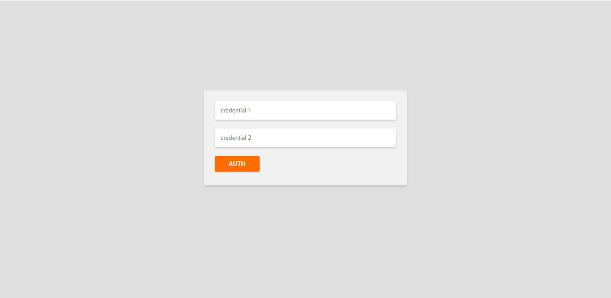
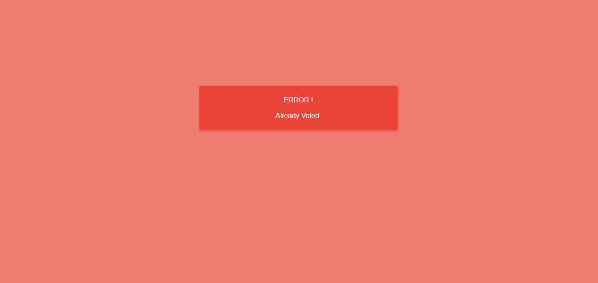

# blockchain
A sample blockchain application(voting) written is JavaScript for the sake of learning. It also contains the basic concepts of blockchain implemented in js which include distrubuted nodes, sharing of blocks and conflict resolution through consensus algorithm(longest chain).

There are GET/POST end-points which can be used to interact with the blockchain.

### Contents:
dev folder - final Voting system code. This also requires the ejs files available in the view folder for templating the nodejs responses for dealing with the voting interface.

dev - till * - contains the intermediate codes. dev - till block explorer carries the whole basic block chain concepts

### To test:
* Clone the repo
* `cd blockchain`
* Run `npm install` to get all the required node modules
* `npm run node_1` there are also node_2 and node_3 which corresponds to the nodes added to the network. Also an organizer node is provided in the package.json file which is used to represent the Voting Organizer's API which validated the login credentials of the voter.
* Navigate to `localhost:1001/blockchain` to get the block chain
  #### Other end points
  * `/transaction/` is a POST endpoint to add a new transaction
  * `/transaction/broadcast` to create and broad cast a new transaction to the entire network
  * `/mine` to mine a new block
  * `/receive-new-block` to recieve a newly mined block and add it to the chain
  * `/register-and-broadcast-node` to add a newly connected node to an existing node and then the existing node broadcasts the newly arrived node to other nodes in the network.
  * `/register-node` accept the new node's address broadcasted by an existing node and add it to the list of nodes
  * `/register-nodes` accept and register multiple nodes at once ( this is usually sent to the newly arrived node as a responce to `register-and-broadcast-node`
  * `/consensus` perform the consensus algorithm
  * `/block/:blockHash` get the details of a block, given it's hash
  * `/address/:address` get the details of a wallet(person), given it's address
  
  * `/vote` perform voting
  * #### There are a few more end-points associated with vote to which the interface navigates a voter.
  
:-------------------------:|:-------------------------:
  |  

### NOTE:
This is a very basic implementation of blockchain concepts. This cannot be used for development(as of now), I think so.
  
